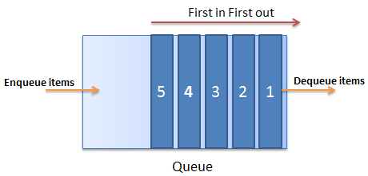
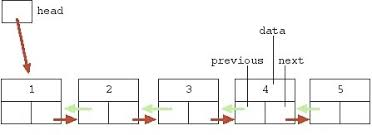
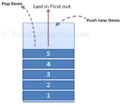

# Collections und Generics
## Inhalt
* Generische Methoden und Klassen
* Constraints in C#
* Was sind Collections
* Generische Interfaces
* Einsatz von Generics in Collections als Datenstruktur
* Quellen  

## Generische Methoden und Klassen

### Generics Bedeutung
Generisch bedeutet im Allgemeinen gültigen Sinne.

#### Motivation:
Man versucht folgende vier "Hauptziele" zu erreichen:
 * Die Typsicherheit zu erhöhen
 * Type-Casts nicht durchführen zu müssen
 * Box'ing und Unbox'ing nicht durchführen zu müssen
 * C# bzw. andere OO-Programiersprachen haben viele 'Templates'

 #### Vorteile gegenüber der verwendung der allgemein Objekt-Klasse:
 * Es entsteht ein klarer Performancegewinn
 * Der Sourcecode ist wiederverwendbar

### Generische Klassen 
'T'oder 'E' werden im Allgemein als die generische Typevariablen verwendent.
Bei der folgende Zeile wird gezeigt, wie eine generische Klasse aufgebaut ist:
~~~cs
access_modifer class ident <T,K> // T, K generic datatType
~~~
Generische Typen können in internen Fields, Properites und Methoden einer Klasse verwendet werden.
~~~cs
public  class Kunde<T>  //TKundenInfo anstelle von T
{                       //wäre geeigneter 
    private static List<T> _kundenListe;
    private T _kundenInfo;
    public T KundenInfo{ get; set; };
    public int VerlgleicheKunden(T KundenInfo);
}
~~~
Bei der Verwendung von generischen Typen ist als es ob man irgend einen anderen nichtgenerischen Typ verwendet.
Die Typ-Parameter müssen lediglich bei der Instanzierung gesetzt werden.
~~~cs
LinkedList<string> myList = new LinkedList<string>();
~~~
## Constraints in C#
Das "Keyword", ***where*** bietet Beschränkungen für einen Typ-Parameter.
Es können auch ein oder mehrere Basisklassen oder ein Interfaces verwendet werden als Einschränkung.
### Beispiel:
~~~cs
public class MyGenericClass<T> where T : IComparable<T> { }
~~~
Hier muss die die Klasse MyGenericClass als Einschränkung das IComarableInterface implementieren. Also ein 'Vertrag' schreibt vor, dass der Typ T 'vergleichbar' sein muss gemäß dem Interface.
### Einen Default Wert verwenden
Das "Keyword" ***default*** 
Wenn T ein Referenztyp ist dann ist defaut(T) *null*;
Für Werttypen wie zum Beispiel int, float,  hier werden alle Bits werden auf *0* gesetzt.

## Was sind Collections?
Collections sind aufzählbare Datenstrukturen die ausgewertet werden können indem man Indexe oder Schlüssel (Keys) verwendet. Datenstrukturen welche nahe in Relation stehen können effizienter gehandhabt werden als jene in einer Collection.
Anstelle für jede Datenstruktur bzw. Datentyp seperaten Code zu schreiben kann man den gleichen Code wiedervewenden um alle Elemente einer Collection zu verarbeiten.

### Einsatz von Generics in Collections
--------------------------------
| Interface    |  Beschreibung |
|:------------|:-------------|
|ICollection(T)|Definiert Methoden <br> um generische Collections zu manipulieren|
|IList(T)   |Repräsentiert eine Collection <br> die über einen Index zugreifen können |
| IEnumerator(T)  | Unterstützt eine einfache Iteration <br> über eine generische Collection |
|  IDictionary(TKey, TValue) | Repräsentiert eine generische Collection <br> eines  Key/Value pair |
IComparer(T)|Definert eine Methode die <br> zwei Objekte vergleicht|

## Arten von generischen Collections als Datenstruktur
*  List \<T>
*  Dictionary \<T>  
*  Queue \<T>
*  LinkedList \<T>
*  SortedDictionary\<K,V> SortedList\<K,V> 
*  Stack \<T>
*  HashSet \<T>
*  u.v.m ....

### List \<T>
Ist eine typisierte Liste über die auch mittels einem Index zugegriffen werden.
####  Beispiel:

```cs
public static void Main(string[] args)
{
    List<int> myintegers = new List<int>();
    myintegers.Add(1);
    myintegers.Add(2);
    myintegers.Add(3);
    
    foreach (int i in myintegers)
    {
        Console.Write("${i.ToString()} "); // 1 2 3
    }
}
```
List \<T> hat auch eine `Sort` Methode welche die Werte entweder spezifiziert mittels einem angegebenen IComparer bzw. IComparable verwendet wird <br>
oder ansonsten mittels einem default comparer sortiert.
Falls mann die Sort Methode spezifiziert verwenden möcht, muss man bei der Klasse das ICompareable\<T> Interface impementieren.
####  Beispiel:
~~~cs
    class Pupil_Class : IComarable<Pupil_Class>
    {
        private string _FirstName;
    }
~~~
#### IComparable Inteface
Die Klasse muss die Methode ``CompareTo()` implementieren.
Das heißt es wird  ein Objekt vom gleichen Typ als Parameter übergeben.
* Es wird eine negative Ganzzahl zurückgegeben wenn das Objekt kleiner ist als das andere
* Es wird wenn das Objekt gleich ist als das andere
* Es wird eine positive Ganzzahl zurückgegeben wenn dieses Objekt größer ist als das andere
#### Beispiel:
~~~cs

public class Rectangel: IComparable<Rectangel>
{
    private int _length, _width, _area;
    ....
    public int Area()
    {   
        _area = length * width
        return _area;;
    }

    public int CompareTo (Rectangel other)
    {
        if(this._area < other._area) return -1;
        else if (this._area > other.area) return 1;
        else return 0;
    }
}
~~~
### Dictionary \<K,V>
Speichert( Schlüssel, Wert); Wobei K (key) hier der Schlüssel ist und V (value) den Wert angiebt.
Der Schlüssel (Key) kann auch als Indexer verwendet werden bzw. dient als schnelle Suche beim Finden der Werte.

#### Beispiel:
~~~cs
 Dictionary<String, Pupil> alle_schüler = new Dictionary<String,Pupil>();
 Pupil x = alle_schüler["Müller"]; 
 Console.WriteLine("${x.Vorname} {X.Nachname} {x.Klasse}");
~~~

 * Die Schlüsselklasse muss Vergleichsoperationen durchführen können. Das heißt gegebenenfalls muss diese eine `CompareTo` Methode implementiert haben.
 * Die Schlüssel müssen einzigartig sein. (unique)  
Also wenn man versucht ein Element mit einem Schlüssel hinzuzufügen wenn bereits ein Schlüssel im Dictionary verwendet wird, wird das Programm eine Exception werfen.
 * Ein Schlüssel darf nicht `null` sein.

 #### Weitere Methoden bzw. Indexerproperities:
 *  `bool Remove(TKey)`
    * löscht das Elemente und lieftert true zurück wenn das Element erfolgreich gefunden wurde.
 *  `Item [TKey]`
    *   Der Wert wird anhand eines Schlüssels zurückgegeben bzw. gesetzt.
 *  `Add(TKey, TValue)`
    *  Der Schlüssel und der Wert werden hinzugefügt.

### Queues \<T>

Hier handelt es sich um Warteschlangen vergleichbar mit einer Warteschlange an einer Supermarktkasse.

#### Die wichtitesten Methoden:
* `Enqueue(T Element)`
  *  Ein Element vom generischen Typ T wird der Warteschlange hinzugefügt.
* `T Deque()`
  *  Es wird ein Elenemt am Kopf der Queue entfernt und das Objekt wird zurückgegeben.
* `Clear(), Contains(T Element), Peek(), ....`

### Linked List \<T>
  
Eine generische Linked List erlaubt den sequenziellen Zugriff auf die einzelnen Elemente entweder von Seite des "Head" oder von Seite des "Tail".
####  Die wichtigesten Methoden bzw. Properties:
~~~cs
var nodeTwo = linkedList.Find("two"); // find first node with value "two"
nodeThree = linkedList.FindLast("three"); // find last node with value "three"
var firstNode = linkedList.First; // get first node in list
var lastNode = linkedList.Last; // get last node in list
linkedList.Remove("two");  // remove the first node with value "two"
linkedList.RemoveFirst(); // remove first node in list
linkedList.RemoveLast(); // remove last node in list
linkedList.Clear(); // remove all items from list
~~~
### SortedDictionary\<K,V> SortedList\<K,V>
Das SortdDictionary und die Sorted List sind ähnlich strukturiert wie ein gewöhlichtes Dictionary wobei diese sortiert werden anhand der Schlüssel.
*   Ist ein Array von 'Key-Value-Pairs'
*   Ein Schlüssel muss 'unique' sein und darf nicht `null` sein
*   Eine SortedList benötigt weniger Speicher als ein SortedDictionary.
*   Die SortedList ist schneller beim Datenabruf als ein SortedDictionary.
*   Das SortedDictionary ist jedoch schneller beim Einfügen und Löschen von 'Key-Value-Pairs'.
### Stack \<T>
  
 Ein Stack ist eine LIFO-Datenstruktur und ist auch in älteren deutschsprachigen Büchern als Kellerspeicher beschrieben (Last in First Out). Das heißt, das letzte Element welches hinzugefügt wurde, wird auch als erstes wieder entfernt.
#### Die wichtigesten Methoden:
*   `void Push(T item) `
    * Fügt ein Element oben auf den Stack hinzu.
*   `T Peek()`
    *  Retourniert das oberste Stack-Element.
*   `T Pop()`
    * Entfernt das oberste Element vom Stack und es wird zurückgegeben.
*  `bool Contains(T item)`
    * Überprüft ob ein existierendes Element sich auf dem Stack befindet oder nicht.
*  `void Clear()`
    *   Entfernt alle Element vom Stack.


### HashSet\<T>
Die HashSet\<T> Klasse stellt hochperformate Vorgänge zu Verfügung. Das Set ist eine Auflistung, die keine doppelten Elemente enthält und wo diese sich in keiner Reihenfolge befinden. Neben den üblichen generischen Methoden wie Add, Count, Contains, Clear und vielen anderne verfügt die HashSet\<T> Klasse auch viele Methoden die bekannt sind aus der Mengenlehre:

+   `UnionWith`
+   `IntersectWith`
+   `ExceptWith`
+   `SymetricExeptWith`
+   `IsSubSetOf`
+   `IsSuperSetOf`

## Quellen
 *  [HTL-Leonding](https://www.htl-leonding.at)
 *  [tutorialsteacher.com](https://www.tutorialsteacher.com/csharp/csharp-dictionary)
 *  [docs.microsoft.com](https://docs.microsoft.com/en-us/dotnet/standard/generics/)

# Collections and Generics
## Inhalt
* Generische Methoden und Klassen
* Constraints in C#
* Was sind Collections
* Generische Interfaces
* Einsatz von Generics in Collections als Datenstruktur
* Quellen  

## Generische Methoden und Klassen

### Generics Bedeutung
Generisch bedeutet im Allgemeinen gültigen Sinne.

#### Motivation:
Man versucht folgende vier "Hauptziele" zu erreichen:
 * Die Typsicherheit zu erhöhen
 * Type-Casts nicht durchführen zu müssen
 * Box'ing und Unbox'ing nicht durchführen zu müssen
 * C# bzw. andere OO-Programiersprachen haben viele 'Templates'

 #### Vorteile gegenüber der verwendung der allgemein Objekt-Klasse
 * Es entsteht ein klarer Performancegewinn
 * Der Sourcecode ist wiederverwendbar

### Generische Klassen 
'T'oder 'E' werden im Allgemein als die generische Typevariablen verwendent.
Bei der Folgende Zeile wird gezeigt, wie eine generische Klasse aufgebaut ist.
~~~cs
access_modifer class ident <T,K> // T, K generic datatType
~~~
Generische Typen können in internen Fields, Properites und Methoden einer Klasse verwendet werden.
~~~cs
public  class Kunde<T>  //TKundenInfo anstelle von T
{                       //wäre geeigneter 
    private static List<T> _kundenListe;
    private T _kundenInfo;
    public T KundenInfo{ get; set; };
    public int VerlgleicheKunden(T KundenInfo);
}
~~~
Bei der Verwendung von generischen Typen ist als es ob man irgend einen anderen nichtgenerischen Typ verwendet.
Die Typ-Parameter müssen lediglich bei der Instanzierung gesetzt werden.
~~~cs
LinkedList<string> myList = new LinkedList<string>();
~~~
## Constraints in C#
Das "Keyword", ***where*** bietet Beschränkungen für einen Typ-Parameter.
Es kann auch eine Basisklasse oder ein Interface verwendet werden als Einschränkung.
### Beispiel:
~~~cs
public class MyGenericClass<T> where T : IComparable<T> { }
~~~
Hier muss die die Klasse MyGenericClass als Einschränkung das IComarableInterface implementieren. Also ein 'Vertrag' schreibt vor dass der Typ T 'vergleichbar' sein muss gemäß dem Interface.
### Einen Default Wert verwenden
Das "Keyword" ***default*** 
Wenn T ein Referenztyp ist dann ist defaut(T) *null*;
Für Werttypen wie zum Beispiel int, float,  hier werden alle Bits werden auf *0* gesetzt.

## Was sind Collections?
Collections sind aufzählbare Datenstrukturen die  ausgewertet werden können indem man Indexe oder Schlüssel (Keys) verwendet.Datenstrukturen welche nahe in Relation stehen können effizienter gehandhabt werden in einer Collection.
Anstelle für jede Datenstruktur bzw. Datentyp seperaten Code zu schreiben kann man den gleichen Code wiedervewenden um alle Elemente einer Colletion zu verarbeiten.

### Einsatz von Generics in Collections
--------------------------------
| Interface    |  Beschreibung |
|:------------|:-------------|
|ICollection(T)|Definiert Methoden <br> um generische Collections zu manipulieren|
|IList(T)   |Repräsentiert eine Collection <br> die über einen Index zugreifen können |
| IEnumerator(T)  | Unterstützt eine einfache Iteration <br> über eine generische Collection |
|  IDictionary(TKey, TValue) | Repräsentiert eine generische Collection <br> eines  Key/Value pair |
IComparer(T)|Definert eine Methode die <br> zwei Objekte vergleicht|
---------

## Arten von generischen Collections als Datenstruktur
*  List \<T>
*  Dictionary \<T>  
*  Queue \<T>
*  LinkedList \<T>
*  SortedDictionary\<K,V> SortedList\<K,V> 
*  Stack \<T>
*  HashSet \<T>
*  u.v.m ....

### List \<T>
Ist eine typisierte Liste über die auch mittels einem Index zugegriffen werden.
####  Beispiel:

```cs
public static void Main(string[] args)
{
    List<int> myintegers = new List<int>();
    myintegers.Add(1);
    myintegers.Add(2);
    myintegers.Add(3);
    
    foreach (int i in myintegers)
    {
        Console.Write("${i.ToString()} "); // 1 2 3
    }
}
```
List \<T> hat auch eine `Sort` Methode welche die Werte entweder spezifiziert mittels einem angegebenen IComparer bzw. IComparable oder ansonsten mittels einem default comparer sortiert.
Die Klasse als Parameter muss das ICompareable\<T> interface impementieren.
####  Beispiel:
~~~cs
    class Pupil_Class : IComarable<Pupil_Class>
    {
        private string _FirstName;
    }
~~~
#### IComparable Inteface
Die Klasse muss das ``CompareTo()` interface implementieren.
Das heißt es wird  ein Objekt vom gleichen Typ als Parameter übergeben.
*   Es wird eine negative Ganzzahl zurückgegeben wenn das Objekt kleiner ist als das andere
* Es wird wenn das Objekt gleich ist als das andere
*   Es wird eine positive Ganzzahl zurückgegeben wenn dieses Objekt größer ist als das andere
#### Beispiel:
~~~cs

public class Rectangel: IComparable<Rectangel>
{
    private int _length, _width, _area;
    ....
    public int Area()
    {   
        _area = length * width
        return _area;;
    }

    public int CompareTo (Rectangel other)
    {
        if(this._area < other._area) return -1;
        else if (this._area > other.area) return 1;
        else return 0;
    }
}
~~~
### Dictionary \<K,V>
Speichert( Schlüssel, Wert); Wobei K (key) hier der Schlüssel ist und V (value) den Wert angiebt.
Der Schlüssel (Key) kann auch als Indexer verwendet werden bzw. dient als schnelle Suche beim Finden der Werte.

#### Beispiel:
~~~cs
 Dictionary<String, Pupil> alle_schüler = new Dictionary<String,Pupil>();
 Pupil x = alle_schüler["Müller"]; 
 Console.WriteLine("${x.Vorname} {X.Nachname} {x.Klasse}");
~~~

 * Die Schlüsselklasse muss Vergleichsoperationen durchführen können. Das heißt gegebenenfalls muss diese eine `CompareTo` Methode implementiert haben.
 * Die Schlüssel müssen einzigartig sein. (unique)  
Also wenn man versucht ein Element mit einem Schlüssel hinzuzufügen wenn bereits ein Schlüssel im Dictionary verwendet wird, wird das Programm eine Exception werfen.
 * Ein Schlüssel darf nicht `null` sein.

 #### Weitere Methoden bzw. Indexerproperities:
 *  `bool Remove(TKey)`
    * löscht das Elemente und lieftert true zurück wenn das Element erfolgreich gefunden wurde.
 *  `Item [TKey]`
    *   Der Wert wird anhand eines Schlüssels zurückgegeben bzw. gesetzt.
 *  `Add(TKey, TValue)`
    *  Der Schlüssel und der Wert werden hinzugefügt.

### Queues \<T>

Hier handelt es sich um Warteschlangen vergleichbar mit einer Warteschlange an einer Supermarktkasse.

#### Die wichtitesten Methoden:
* `Enqueue(T Element)`
  *  Ein Element vom generischen Typ T wird der Warteschlange hinzugefügt.
* `T Deque()`
  *  Es wird ein Elenemt am Kopf der Queue entfernt und das Objekt wird zurückgegeben.
* `Clear(), Contains(T Element), Peek(), ....`

### Linked List \<T>
  
Eine generische Linked List erlaubt den sequenziellen Zugriff auf die einzelnen Elemente entweder von Seite des "Head" oder von Seite des "Tail".
####  Die wichtigesten Methoden bzw. Properties:
~~~cs
var nodeTwo = linkedList.Find("two"); // find first node with value "two"
nodeThree = linkedList.FindLast("three"); // find last node with value "three"
var firstNode = linkedList.First; // get first node in list
var lastNode = linkedList.Last; // get last node in list
linkedList.Remove("two");  // remove the first node with value "two"
linkedList.RemoveFirst(); // remove first node in list
linkedList.RemoveLast(); // remove last node in list
linkedList.Clear(); // remove all items from list
~~~
### SortedDictionary\<K,V> SortedList\<K,V>
Das SortdDictionary und die Sorted List sind ähnlich strukturiert wie ein gewöhlichtes Dictionary wobei diese sortiert werden anhand der Schlüssel.
*   Ist ein Array von 'Key-Value-Pairs'
*   Ein Schlüssel muss 'unique' sein und darf nicht `null` sein
*   Eine SortedList benötigt weniger Speicher als ein SortedDictionary.
*   Die SortedList ist schneller beim Datenabruf als ein SortedDictionary.
*   Das SortedDictionary ist jedoch schneller beim Einfügen und Löschen von 'Key-Value-Pairs'.
### Stack \<T>
  
 Ein Stack ist eine LIFO-Datenstruktur und ist auch in älteren deutschsprachigen Büchern als Kellerspeicher beschrieben (Last in First Out). Das heißt, das letzte Element welches hinzugefügt wurde, wird auch als erstes wieder entfernt.
#### Die wichtigesten Methoden:
*   `void Push(T item) `
    * Fügt ein Element oben auf den Stack hinzu.
*   `T Peek()`
    *  Retourniert das oberste Stack-Element.
*   `T Pop()`
    * Entfernt das oberste Element vom Stack und es wird zurückgegeben.
*  `bool Contains(T item)`
    * Überprüft ob ein existierendes Element sich auf dem Stack befindet oder nicht.
*  `void Clear()`
    *   Entfernt alle Element vom Stack.


### HashSet\<T>
Die HashSet\<T> Klasse stellt hochperformate Vorgänge zu Verfügung. Das Set ist eine Auflistung, die keine doppelten Elemente enthält und wo diese sich in keiner Reihenfolge befinden. Neben den üblichen generischen Methoden wie Add, Count, Contains, Clear und vielen anderne verfügt die HashSet\<T> Klasse auch viele Methoden die bekannt sind aus der Mengenlehre:

+   `UnionWith`
+   `IntersectWith`
+   `ExceptWith`
+   `SymetricExeptWith`
+   `IsSubSetOf`
+   `IsSuperSetOf`

## Quellen
 *  [HTL-Leonding](https://www.htl-leonding.at)
 *  [tutorialsteacher.com](https://www.tutorialsteacher.com/csharp/csharp-dictionary)
 *  [docs.microsoft.com](https://docs.microsoft.com/en-us/dotnet/standard/generics/)

[Zur Übersicht](../README.md)
