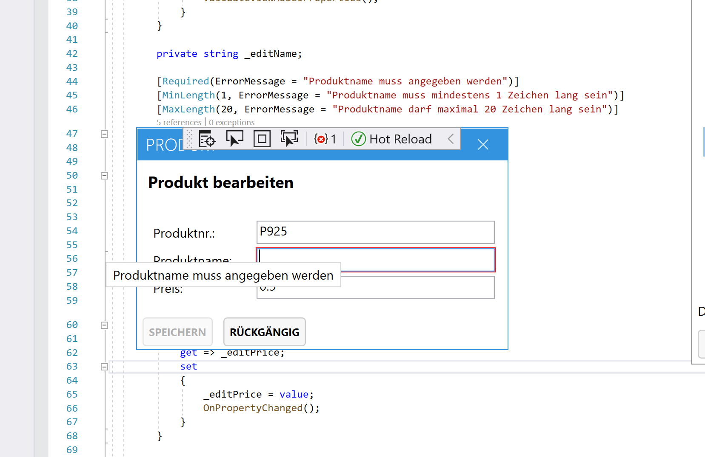
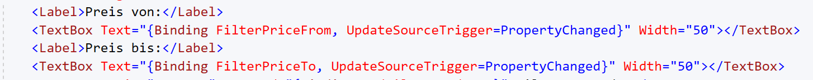
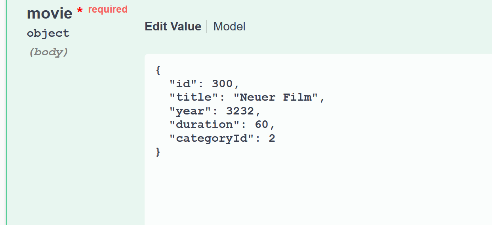
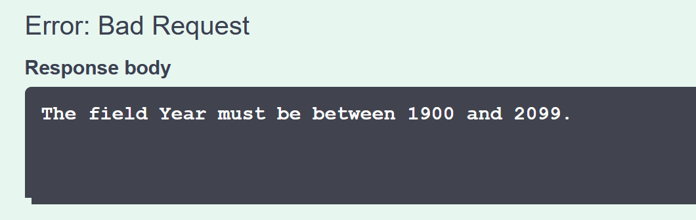

# Entity Framework Validation

## Validierung allgemein

* Bietet eine Möglichkeit, eine benutzerdefinierte Regel zu erstellen, um die Gültigkeit von Benutzereingaben zu überprüfen.

* Selbes Konzept für mehrere Ebenen:
    * WPF -> Validierung am Desktop
    * Web-UI clientseitig -> Validierung im Browser
    * Entity direkt -> Domainspezifisch
    * Persistenzschicht -> Datenbankabhängig

* Validation-Framework:
    * Ermöglicht Validierung in allen Bereichen
    * Validation Exception zum Transport von Exceptions
    * Kernklasse Validator (statisch):
        * `ValidateObject(Object, ValidationConext)`
        * `TryValidateObject(Object, ValidationContext ICollection <ValidationResult>)`
        * `ValidateProperty(Object, ValidationContext)`

## Möglichkeiten
* DataAnnotations für einzelne Properties:
    * MaxLength, RegEx, EmailAddress, ...
    * CustomValidation
    * Eigene Annotationsklassen


### Beispiel für Vordefinierte Annotations:
* Required, Range
```c#
[Required]
[Range(1, int.MaxValue, ErrorMessage = "Runde muss positive Ganzzahl > 0 sein")]
public int Round {get; set;}

```
* Required, MinLength, MaxLength
```c#
private string _editName;

[Required]
[MinLength(1, ErrorMessage = "Produktname muss mindestens 1 Zeichen lang sein")]
[MaxLength(20, ErrorMessage = "Produktname darf maximal 20 Zeichen lang sein")]
public string EditName
{
    get => _editName;
    set
    {
        _editName = value;
        OnPropertyNameChanged();
    }
}
```


### Beispiel Custom Validation:
```c#
 public class SVNrValidation : ValidationAttribute
    {
        protected override ValidationResult IsValid(object value, ValidationContext validationContext)
        {
            if (SVNrCheck(svnr))
            {
                return ValidationResult.Success;
            }

             return new ValidationResult($"Sozialversicherungsnummer {svnr} ist nicht gültig");
        }
    }
```
```c#
[SVNrValidation]
public string SVNr { get; set; }
```

## Datenbank

* Die Prüfung erfordert den Zugriff auf die Datenbank
* Prüfmethode benötigt IUnitOfWork
* Aufruf der Validierung über SaveChanges-Methode

### Beispiel Datenbank Validation:
* Überprüfung, ob Produkt bereits in DB existiert
```c#
private async Task ValidateEntity(object entity)
{
    if (entity is Product product)
    {
        if (await _dbContext.Products.AnyAsync(b => b.ProductNr != product.ProductNr
        && b.Name == product.Name))
        {
            throw new ValidationException($"Produkt mit den Namen {product.Name} existiert bereits");
        }
    }
}
```
```c#
public async Task<int> SaveChangesAsync()
{
    var entities = _dbContext.ChangeTracker.Entries()
    .Where(entity => entity.State == EntityState.Added || entity.State == EntityState.Modified)
    .Select(e => e.Entity);
    foreach(var entity in entities)
    {
        await ValidateEntity(entity);
    }
    return await _dbContext.SaveChangesAsync();
}
```

## WPF

* Um die WPF Validierung nutzen zu können benötigt man im zugehörigen ViewModel das Interface INotifyDataErrorInfo.

* HasErrors (Property):
    * Sind Fehler am ViewModel vorhanden?
    * Methode:
    ```c#
      get { return _hasErrors; }
      set { _hasErrors = value; OnPropertyChanged(); }
    ```
* ErrorsChanged (EventHandler):
    * Bei Änderungen der Validität des ViewModels
    ```c#
       public void OnErrorsChanged(string propertyName = null)
        {
            ErrorsChanged?.Invoke(this, new DataErrorsChangedEventArgs(propertyName));
        }
     ```
* GetErrors (Methode):
    * Liefert pro Binding-Property die (!)
    Fehlermeldung
    ```c#
   public IEnumerable GetErrors(string propertyName)
        {
            return propertyName != null && Errors.ContainsKey(propertyName)
                ? Errors[propertyName]
                : Enumerable.Empty<string>();
        }
    ```
* Wichtig ist zudem auch den `UpdateSourceTrigger` auf `PropertyChanged` zu setzen um nach jedem Zeichen die Eingabe zu validieren.


### Validierungsfehler

* Um Validierungsfehler beim Speichern des Contexts auszuwerten, muss die ValidationException im ViewModel abgefangen werden.
* Sollten Fehler auftreten werden diese einem ViewModel-Property (DbError) zugewiesen, welches am Window gebunden ist.

```c#
try
{
    await uow.SaveChangesAsync();
}
catch (ValidationException ve)
{
    if (ve.Value is IEnumerable<string> properties)
    {
        foreach (var property in properties)
        {
            Errors.Add(property, new List<string> {ve.ValidationResult.ErrorMessage});
        }
    }
    else
    {
        DbError = ve.ValidationResult.ToString();
    }
}
```

```c#
public String DbError
    {
      get { return _dbError; }
      set { _dbError = value; OnPropertyChanged(); }
    }
```


### ValidationAttribute
* Dient als Basisklasse für alle Validierungsattribute. Ihre Methoden können überschrieben werden, um benutzerdefinierte Validierungsattribute zu erstellen.
    * Beispiele:
        * Equals()
        * IsValid()
        * Validate()
        * ...

### IValidatableObject
#### Beispiel Validate() (IValidatableObject):
* Diese wird in den Properties aufgerufen, in welchen sie benötigt wird.

```c#
class EditCustomerViewModel : BaseViewModel
{
        public string Lastname
        {
            get => _lastname;
            set
            {
                _lastname = value;
                OnPropertyChanged(nameof(Lastname));
                Validate();
            }
        }
}
```


* Die Validate-Methode der BaseViewModel vom Interface IValidatableObject wird überschrieben
* Sie wird zur Validierung der einzelnen Properties verwendet und stellt eine Alternative zur Validierung per Validierungunsattribute in den Modellklassen dar!

```c#
public override IEnumerable<ValidationResult> Validate(ValidationContext validationContext)
{
      if (string.IsNullOrWhiteSpace(Lastname))
      {
        yield return new ValidationResult("Lastname is required",new string[] { nameof(Lastname) });

      }
     else if (Lastname.Length < 2)
     {
        yield return new ValidationResult("Minimum length of Lastname is 2", new string[] { nameof(Lastname) });

     }
}
```
* Yield liefert mehrere Return-Werte => `IEnumberable<ValidationResult>`
### Ohne ValidateAttribute
```c#
 class EditCustomerViewModel : BaseViewModel
    {

        public string _lastname;

        [Required(ErrorMessage ="Lastname is required")]
        [MinLength(2, ErrorMessage ="Minimum length of Lastname is 2")]
        public string Lastname
        {
            get => _lastname;
            set
            {
                _lastname = value;
                OnPropertyChanged(nameof(Lastname));
            }
        }
}
```

## Enity direkt
* Validierung erfolgt direkt der Entity "Customer"
```c#
public partial class Customer
{
    [Required]
    [DisplayName("Kundennr.")]
    public string CustomerNr { get; set; }

    [MaxLength(20)]
    [DisplayName("Vorname")]
    public string FirstName { get; set; }
}
```

## Web-UI clientseitig
* Durch Verwendung von vordefinierten Annotationen, eigenen Annotationen oder Custom Validations

### Beispiel vordefinierte Annoationen:
 ```c#
 [Range(1900,2099)]
 public int Year {get; set;}
 ```

 

 

 ### Beispiel eigene Annotationsklassen:
```c#
[ClassicMovieMaxDurationAttribute(isClassicMovieUntilYear: 1950, maxDurationForClassicMovie: 60)]
public int Duration {get; set;}
```
* Über ValidationAttribute

```c#
 public class ClassicMovieMaxDurationAttribute : ValidationAttribute
    {
        public ClassicMovieMaxDurationAttribute(int isClassicMovieUntilYear, int maxDurationForClassicMovie)
        {
            IsClassicMovieUntilYear = isClassicMovieUntilYear;
            MaxDurationForClassicMovie = maxDurationForClassicMovie;
        }

        protected override ValidationResult IsValid(object value, ValidationContext validationContext)
        {
            var movie = (Movie)validationContext.ObjectInstance;
            if (movie.Year <= IsClassicMovieUntilYear && movie.Duration > MaxDurationForClassicMovie)
            {
                return new ValidationResult($"Classical Movies (until year '{IsClassicMovieUntilYear}') may not last longer than {MaxDurationForClassicMovie} minutes!",
                    new List<string> { validationContext.MemberName });
            }

            return ValidationResult.Success;
        }

        public int IsClassicMovieUntilYear { get; }
        public int MaxDurationForClassicMovie { get; }

    }
```
### Validierung Razor Pages
Beispiel Edit:
```c#
  <div class="form-group">
    <label asp-for="Sensor.Name class="control-label"></label>
    <input asp-for="Sensor.Name" class="form-control" />
    <span asp-validation-for="Sensor.Name" class="text-danger"></span>
  </div>
```
```c#
 public async Task<IActionResult> OnPost()
 {
    if (!ModelState.IsValid)
    {
        return Page();
    }
    var dbSensor = await _unitOfWork.SensorRepository.GetByIdAsync(Sensor.Id);

    if (dbSensor == null)
    {
        return NotFound();
    }

    dbSensor.Name = Sensor.Name;
    try
    {
        await _unitOfWork.SaveChangesAsync();
        return RedirectToPage("/Index");
    }
    catch (ValidationException validationException)
    {
        ValidationResult valResult = validationException.ValidationResult;
        ModelState.AddModelError("", valResult.ErrorMessage);
    }
    return Page();
 }
```
[Zur Übersicht](../README.md)