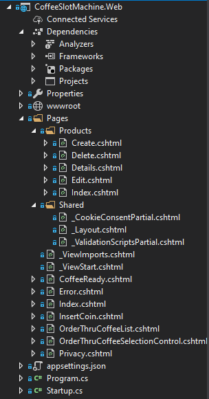

# *Razor Pages ASP.NET Core*

## What are Razor Pages?
Razor Pages sind eine alternative zum klassischen [MVC](https://docs.microsoft.com/en-us/aspnet/core/tutorials/first-mvc-app/start-mvc?view=aspnetcore-5.0) (Model View Controller) - Pattern wenn es darum geht, serverseitige, page-focused Web-Applikationen zu erstellen. In junger Vergangenheit haben sich Razorpages in dem Bereich als Standard etabliert.
## Why not MVC?
Das Razor Pages Framework verzichtet auf viele unnötige Zeremonien die nötig sind, um eine Anwendung in MVC zu erstellen, ist simpler aufgebaut und somit auch besser wartbar und übersichtlicher.
Komponenten im MVC Framework haben immernoch ihren Nutzen, zum Beispiel wenn man Controller für RESTful APIs braucht.
## How does it work?
Alle Razor-Files enden mit *.cshtml*. Die meisten dieser Files enthalten eine Mischung aus client- und serversided code, wenn dieser verarbeitet wird, entsteht HTML-Code der an den Browser geschickt wird.
Diese Pages werden normalerweise "content pages" genannt, die im folgenden genauer beschrieben werden.
### [Content Pages](https://www.learnrazorpages.com/razor-pages)
Damit sich ein File als Content-Page verhält, sind 3 Eigenschaften unverzichtbar:
 - Es darf nicht mit einem "leading-underscore" benannt sein: ~~*_razorpage.cshtml*~~
 - Das File hat die Endung *.cshtml*
 - Das erste Zeile des Files startet mit *@page* (ähnliches verhalten .xml header)
### [Different types of Razor files](https://www.learnrazorpages.com/razor-pages/files/)
Andere Razor Files haben einen "leading underscore" im Namen, welcher häufig dafür benutzt wird um partial pages zu benennen. Die drei Folgenden Files haben aber bestimmte Funktionen innerhalb der Razor Pages Applikation.
 
 **_Layout.cshtml**
Das _Layout.cshtml File fungiert als Template für alle content-pages die es referenzieren.  Es beinhalten normalerweise header, footer, navigation und so weiter. Typischerweise beinhaltet das _Layout.cshtml im \<head> auch globalen Styling-Referenzén (CSS). Möchte man also den Style der Anwendung anpassen, so muss man oft nur im_Layout.cshtml Anpassungen vornehmen. 

**_ViewStart.cshtml**
Beinhaltet Code, der nach jedem Code in sämtlichen content-pages im selben Ordner oder in Subordnern ausgeführt wird. 

**_ViewImports.cshtml**
Stellt Directives global zur Verfügung, in dem das _ViewImports.cshtml File im root-Folder der Anwendung platziert wird. Alle Razor-Pages im Projekt, die hierachisch darunterliegen haben auf den Inhalt Zugriff.

**[Partial Pages](https://www.learnrazorpages.com/razor-pages/partial-pages)**
Partial Pages oder Views sind Razor-Files die teile von HTML und server-side code beinhalten. Sie werden benutzt, um komplexe Sachverhalte aufzuteilen und vorallem um in Teams die Aufgabenteilung zu erleichtern. (Work units)
__________
## Grundlegende Architektur
Die Grundlegende Razor Pages Architektur lässt sich wie folgt beschreiben:
Jede Seite (Page) unserer Website ist durch zwei Files repräsentiert
~~~
-   A  _view page_, die Informationen darstellt, und
-   A  _page model_, welches Zugriff und Verarbeitung der Informationen handhabt.
~~~
Beispiel: 
Wir erstellen eine Website für eine Bäckerei die Online Bestellungen verarbeiten soll. Wenn ein User die Website besucht, sieht er eine Seite die ein Menü und ein Formular zur Bestellung beinhaltet. Die Darstellung des Menüs und des Formulars wird in der view-page definiert. Wie das Menü beim Navigieren und das Formular beim Eingeben der Daten reagiert, wird im zugehörigen page-model definiert.

## Routing
Routing ist das System, das dafür zuständig ist, URL's den zugehörigen Razorpages zuzuordnen. Wie die meisten "pagecentric" Frameworks ist das Routingsystem in ASP.NET Razor Pages darauf aufgebaut URL's File-Paths zuzuorden, ausgehend vom Root Ordner. (Siehe "Pages" Ordner im Image oberhalb)

### Wie werden URL's zugewiesen?
Wenn eine Razor Pages Application gestartet wird, wird eine Collection von "Attribute Routes" generiert. Dabei werden die File und Folder Pfade im Pages folder als Basis für das Template verwendet.
~~~
Das Standard RazorPages Template besteht aus drei Paegs im root Folder (Pages):
- Error.cshtml
- Index.cshtml
- Privacy.cshtml
~~~

Index.cshtml ist standartmäßig als "default-page" festgelegt, hat also zwei Routen definiert: Einmal als empty string nach der URL und einmal mit "Index" ohne postfix ".cshtml"
~~~
Beispiel URL's:
- http://yourdomain.com/
- http://yourdomain.com/index

Diese beiden Routen sind auf den selben virtuellen Pfad gemappt: /<root>/Test/Index.cshtml
~~~

### Areas
Areas wurden in APS.NET Core 2.1 zu Razor Pages integriert. Routen, die in gemeinsamen Areas definiert sind beinhalten den Namen der Area als erstes Segment der URL.

~~~
Areas
    Adminstration
        Pages
            Index.cshtml
            Reports.cshtml
    Production
        Pages
            Index.cshtml
Pages
    Error.cshtml
    Index.cshtml
    Privacy.cshtml
~~~

Die generierten Routen für den Content in den Areas sehen wie folgt aus:
~~~
"Adminstration"
"Administration/Index"
"Administration/Reports"
"Production"
"Production/Index"
~~~

### Den Default-Root Ordner ändern
Es gibt zwei Varianten den Razor Pages Root Ordner zu ändern:
1. Configuration:
~~~
public void ConfigureServices(IServiceCollection services)
{
    services.AddRazorPages()
    .AddRazorPagesOptions(options => {
        options.RootDirectory = "/Content";
    });
}
~~~
2. WithRazorPagesRoot extension-Methode
~~~
public void ConfigureServices(IServiceCollection services)
{
    services.AddRazorPages().WithRazorPagesRoot("/Content");
}
~~~
### Route Templates
Route Data Parameter werden in einem Route Template festgelegt. Dieses Template ist ein Teil des @page Direktivs im .cshtml file. 
~~~
@page "{title}"
~~~
Das vorangegangene Beispiel arbeitet als Platzhalter. Die Template Definition muss in Quotes gesetzt sein, und der Parameter muss in geschwungenen Klammern angegeben werden.
In diesem Beispiel *muss* ein Wert angegeben werden. Um den Parameter optional zu kennzeichnen kann er mit einem "?" erweitert werden.
~~~
@page "{title?}"
~~~
Außerdem kann ein Default Wert angegeben werden:
~~~
@page "{title=first post}"
~~~
Es können auch mehrere Parameter angegeben werden:
~~~
@page "{year}/{month}/{day}/{title}"
~~~

Es gibt jedoch 5 Keywords die nicht als route-names verwendet werden dürfen:
~~~
- action
- area
- controller
- handler
- page
~~~

### Zugriff auf Route-Parameter
Die Route-Parameter werden in einem RouteValueDictionary gespeichert und sind durch RouteData.values zugreifbar. Man kann die Parameter folgenderweise referenzieren:
~~~
@RouteData.Values["title"]
~~~

Ein potenzielles Problem dieser Variante ist, dass es auf String referenzen basiert. Diese (durch den User eingegebenen) Strings sind anfällig für typographische Fehler, welche in Runtime-Errors resultieren. Die empfohlene Alternative wäre es, die Property-Values an ein PageModel zu "binden". Um dies zu tun, kann ein public Property im entsprechenden PageModel angelegt werden, auf das über die OnGet() Methode zugegriffen werden kann.
~~~
public class PostModel : PageModel
{
    public string Title { get; set; }
    public void OnGet(string title)
    {
        Title = title;
    }
}
~~~

Man kann den Parameter Value dem Public Property zuweisen, womit man es im Model Property auf der content-page zugreifbar macht:
~~~
@page "{title?}"
@model PostModel
@{
}
<h2>@Model.Title</h2>
~~~
Der Hauptgrund für diesen Ansatz ist, dass man so strong-typing sicherstellt und somit Intellisense support sicherstellt.

Alternativ kann man das \[BindProperty\] Attribut auf das PageModel Property mit SupportsGet = true setzen:
~~~
 public class PostModel : PageModel
{
    [BindProperty(SupportsGet = true)]
    public string Title { get; set; }
    public void OnGet()
    {
        // the Title property is automatically bound
    }
}
~~~

### Constraints hinzufügen
Man kann den Route Parametern auch Constraints zuweisen, die den Datentyp bzw. eine eventuelle Range definieren:
~~~
@page "{id:int}"
@page "{latitude:double?}"
@page "{id:min(10000)}"
@page "{username:alpha:minlength(5):maxlength(8)}"
~~~

### Override Routes
Man kann Routen overriden, d.h.: Eine Route unabhängig des Pfades definieren. Das ist nützlich, wenn ein File tief in Unterordnern des Projekts liegt, aber eine einfachere URL erhalten soll. Das ganze kann man im Template festlegen:
~~~
Pfad im Projekt: Pages/Projects/Building/SOP/Schools/Intro.cshtml
--> @page "/schools/sop"
~~~
### Weitere Routing Optionen

| Property  | Type  |  Description | 
|:-:|:-:|:-:|
| AppendTrailingSlash  |  bool | Appends a trailing slash to URLs generated by the anchor tag helper or UrlHelper. Default is false
  |
| ConstraintMap  | IDictionary<string, Type>	  | Enables the registration of custom constraints via the Add method
  |
|  LowercaseUrls |  bool |  URLs are generated all in lower case. The default is false
 |
| LowercaseQueryStrings  | bool  |  Query strings are generated all in lower case. The default is false. Will only take effect if LowercaseUrls is also true
 |
## Details Page-Models
Der Grundgedanke der PageModel Klasse ist es, eine klare Trennung zwischen UI Layer und Logic Layer zu gewährleisten. Es gibt einige Gründe dafür:
~~~
- Es reduziert die Komplexität des UI Layers, also sorgt für einfachere Wartbarkeit
- Es ermöglicht automatisiertes unit testing
- Es ermöglicht größere Flexibilität im Bezug auf Teamarbeit. (Arbeitsteilung UI & Logic)
- Es ermöglicht größere Flexibilität im Bezug auf Erweiterungen des Projekts
~~~
Aufgrund der Features und Funktionalität, ist die PageModel Klasse eine Kombination aus einem Controller und einem ViewModel:

### Controllers
Das Page Controller Pattern ist ein eins-zu-eins mapping zwischen Pages und deren Controllern. Wie vorher schon erwähnt hat also eine Page immer einen Controller, und umgekehrt.
### View Models
In RazorPages, das PageModel ist ebenso ein ViewModel. Deshalb wird bei RazorPages oft als MVVM Pattern beschrieben. (Model View ViewModel) 

## Tag Helper
Tag Helper sind wiederverwendbare Komponenten um HTML in RazorPages automatisch zu generieren. Tag Helpers beziehen sich dabei auf spezifische HTML Tags, im folgenden die meist genutzten.

- Anchor tag helper
- Cache tag helper
- Environment tag helper
- Form Action tag helper
- Form tag helper
- Image tag helper
- Input tag helper
- Label tag helper
- Link tag helper
- Option tag helper
- Partial tag helper
- Script tag helper
- Select tag helper
- Textarea tag helper
- Validation tag helper
- Validation Summary tag helper-

### Anchor tag helper
Der Anchor tag helper bezieht sich auf den AnchorTag in HTML (<a>) welcher genutzt wird um Links in HTML darzustellen.

Er generiert Url's aufgrund des Page-Namens, die Url wird dann Großgeschrieben:
~~~
<a asp-page="page">Click</a>
 wird zu
<a href="/Page">Click</a>
~~~
Falls nicht gewünscht wird, dass die generierte Url großgeschrieben wird, kann das in den RouteOptions eingestellt werden:
~~~
public void ConfigureServices(IServiceCollection services)
{
    services.AddMvc();
    services.Configure<RouteOptions>(options =>
    {
        options.LowercaseUrls = true;
    });
}
~~~
### Cache tag helper
Der Cache tag helper erlaubt es Regionen einer RazorPage im Speicher des Servers zu cachen. Diese Funktion wird hauptsächlich benutzt um die Performance der Website zu erhöhen.
Er ist per default immer aktiviert, kann aber an bestimmten Tagen, im Beispiel Sonntags, deaktiviert werden:
~~~
<cache enabled="DateTime.Now.DayOfWeek != DayOfWeek.Sunday">@DateTime.Now</cache>
~~~
Falls keine Werte für das expires Attribut angegeben werden, cached er alles bis der memory gecleared wird. Man kann dieses expires attribut folgendermaßen setzen (In diesem Fall wird das Item 1 Stunde gespeichert) :
~~~
<cache expires-after="TimeSpan.FromHours(1)">@DateTimeNow</cache>
~~~
### Environment tag helper
Der Environment tag helper erlaubt es, verschiedene Inhalte abhängig von deren aktuellen Werten zu render und wird genutzt, um CSS oder JS Files zu inkludieren.
Beispiel:
~~~
<environment names="Development">            
    <link rel="stylesheet" href="~/css/style1.css" />
    <link rel="stylesheet" href="~/css/style2.css" />
</environment>
<environment names="Staging, Test, Production">
    <link rel="stylesheet" href="~/css/style.min.css" />
</environment>
~~~
### Form Action tag helper
Der Form Action tag helper erlaubt es ein "formaction" attribut einem Element hinzuzufügen, und wird bei Buttons und Inputs verwendet.
Der folgende Code leitet die form zu der Index-Action des HomeControllers weiter wenn der input oder button selected sind:
~~~
<form method="post">
    <button asp-controller="Home" asp-action="Index">Click Me</button>
    <input type="image" src="..." alt="Or Click Me" asp-controller="Home" asp-action="Index">
</form>
~~~
Falls die Ziel-Url mehrere route-parameter enthält, können diese folgendermaßen dem all-route-data parameter übergeben werden: (gilt allgemein)
~~~
@{   
    var d = new Dictionary<string, string>
        {
           { "key1", "value1" },
           { "key2", "value2" }
        };
}
<button asp-all-route-data="d">Submit</button>
~~~
### Form Tag Helper
Der Form Tag Helper rendert ein "action" Attribut innerhalb eines Form Elements.
Beispiel:
Generiert aus: 
~~~
<form asp-controller="Demo" asp-action="Register" method="post">
    <!-- Input and Submit elements -->
</form>
~~~
folgendes:
~~~
<form method="post" action="/Demo/Register">
    <!-- Input and Submit elements -->
    <input name="__RequestVerificationToken" type="hidden" value="<removed for brevity>">
</form>
~~~
Submit to Route Beispiel:
~~~
public class HomeController : Controller
{
    [Route("/Home/Test", Name = "Custom")]
    public string Test()
    {
        return "This is the test page";
    }
}
~~~
### Image Tag Helper
Der Image Tag Helper bezieht sich auf das  Element in HTML und erlaubt die Versionierung von Image-Files.
Generiert aus: 
~~~

~~~
folgendes:
~~~

~~~
### Input Tag Helper
Der Input Tag Helper generiert "name" und "id" Attribute basierend auf das PageModel Property dem er zugewiesen ist. Außerdem unterstützt dieser somit client-sided validation.
Beispiel:
Wir haben folgende Klasse:
~~~
public class Member
{
    public int PersonId { get; set; }
    public string Name { get; set; }
    [EmailAddress]
    public string Email { get; set; }
    [DataType(DataType.Password)]
    public string Password { get; set; }
    [DataType(DataType.PhoneNumber)]
    public string Telephone { get; set; }
    [Display(Name="Date of Birth")]
    public DateTime DateOfBirth { get; set; }
    public decimal Salary { get; set; }
    [Url]
    public string Website { get; set; }
    [Display(Name="Send spam to me")]
    public bool SendSpam { get; set; }
    public int? NumberOfCats { get; set; }
    public IFormFile Selfie { get; set; }
}
~~~
Die wir als Property einem PageModel hinzufügen:
~~~
public class RegisterModel : PageModel
{
    [BindProperty]
    public Member Member { get; set; }
    public void OnGet()
    {
    }
}
~~~
So werden dann die Properties des Models zu input tag helpers im Razor file die dann benutzt werden können:
~~~
<form method="post">
    <input asp-for="Member.PersonId" /> 
    <input asp-for="Member.Name" /> 
    <input asp-for="Member.Email" /> 
    <input asp-for="Member.Password" /> 
    <input asp-for="Member.Telephone" /> 
    <input asp-for="Member.Website" /> 
    <input asp-for="Member.DateOfBirth" /> 
    <input asp-for="Member.Salary" /> 
    <input asp-for="Member.SendSpam" /> 
    <input asp-for="Member.NumberOfCats" /> 
    <input asp-for="Member.Selfies" /> 
    <button>Submit</button>
</form>
~~~
### Label Tag Helper
Der Label Tag Helper generiert passende "for" Attribut Values basierend auf dem PageModel Property dem er zugewiesen ist. Er wird in Verbindung mit dem Input Tag Helper verwendet.
Nehmen wir an das PageModel hat ein Property "Email" so wird:
~~~
<label asp-for="Email"></label>
<label asp-for="Email">MailAdress</lagel>
~~~
zu folgendem gerendert:
~~~
<label for="Email">Email</label>
<label for="MailAdress">MailAdress</label> (override) 
~~~
Zu beachten! Das </lagel> closing tag ist mandatory!
### Link Tag Helper
Der Link Tag Helper wird benutzt um links dynamisch zu den CSS Files zu generieren, beziehungsweise um fallbacks zu generieren falls das Zielfile nicht erreichbar ist. (z.B.: wenn das Zielfile remote gelagert ist und aus irgendeinem Grund nicht verfügbar ist)
(nur mit CDN Version von CSS verwendbar)
### Options Tag Helper
Der Options Tag Helper wird in Verbindung mit dem Select Tag Helper verwendet und hat zwei Verwendungszwecke:
~~~
1. Er erlaubt es manuell items zu einer Liste von Optionen hinzuzufügen die gerendert werden.

2. Falls eine der Option Values, die manuell hinzugefügt wurden dem Select Tag Helper "for" Attribut gleichen, wird dieser als "selected" gesetzt.
~~~
Das erste Beispiel zeigt eine default option die händisch zum select tag helper hinzugefügt wurde. Nehmen wir an wir haben ein simples PageModel mit einem Property "Items", welches eine Collection von SelectListItem darstellt, die zu einem select tag helper hinzugefügt werden soll. Die Optionen sind die Nummern 1 bis 3. Außerdem hat das PageModel ein Property "Number", welches das selektierte Item repräsentiert:
~~~
public class TaghelpersModel : PageModel
{
    public List<SelectListItem> Items => 
        Enumerable.Range(1, 3).Select(x => new SelectListItem {
            Value = x.ToString(),
            Text = x.ToString()
        }).ToList();
    public int Number { get; set; }
    public void OnGet()
    {
 
    }
}
~~~
Weiters haben wir einen select Tag helper mit einem Option Tag Helper ohne Value:
~~~
<select asp-for="Number" asp-items="Model.Items">
    <option value="">Pick one</option>
</select>
~~~
Das resultiert in folgenden generierten HTML code:
~~~
<select data-val="true" data-val-required="The Number field is required." id="Number" name="Number">
    <option value="">Pick one</option>
    <option value="1">1</option>
    <option value="2">2</option>
    <option value="3">3</option>
</select>
~~~
### Partial Tag Helper
Der Partial Tag Helper wird benutzt um die Html.Partial und Html.RenderPartial Methoden zu ersetzen und Partial Pages einzubinden.
Wird benutzt, um partiellen Content asynchron zu laden:
Das folgende Beispiel sucht _MyPartial.cshtml in Pages, Pages/Shared und Views/Shared:
~~~
<partial name="_MyPartial" ... />
~~~
### Script Tag Helper
Die Aufgabe des Script Tag Helpers ist es, links dynamisch zu den Script Files und Fallbacks zu generieren.
### Select Tag Helper
Die Aufgabe des Select Tag Helpers ist es, HTML "select" Elemente mit den generierten Optionen der SelectListItem Obejcts zu rendern, welche über den Options Tag Helper definiert wurden.

#### Set Selected Item
Das SelectListItem hat ein bool Property "Selected", welches benutzt wird um das selektierte Item zu setzen. Wird das gemacht, ist der Value des Propertys als selected gesetzt, vorausgesetzt es gibt ein Match in SelectListItem:
~~~
[BindProperty]
public int Person Person { get; set; } = 3;
public List<SelectListItem> People { get; set; }
public void OnGet()
{
    People = new List<SelectListItem> {
        new SelectListItem { Value = "1", Text = "Mike" },
        new SelectListItem { Value = "2", Text = "Pete" },
        new SelectListItem { Value = "3", Text = "Katy" },
        new SelectListItem { Value = "4", Text = "Carl" }
    };
}
~~~
~~~
<select asp-for="Person" asp-items="Model.People">
    <option value="">Pick one</option>
</select>
~~~
Das resultiert in folgenden generierten HTML code:
~~~
<select data-val="true" data-val-required="The Person field is required." id="Person" name="Person">
    <option value="">Pick one</option>
    <option value="1">Mike</option>
    <option value="2">Pete</option>
    <option selected="selected" value="3">Katy</option>
    <option value="4">Carl</option>
</select>
~~~
#### SelectList
Man kann SelectList aus jeder Collection erstellen, allerdings müssen DataTextField und DataValueField korrekt gesetzt werden damit der select tag helper die Optionen richtig bindet:
~~~
public SelectList Options { get; set; }
public void OnGet()
{
    Options = new SelectList(context.Authors, "AuthorId", "Name");
}
~~~
### Textarea Tag Helper
Die Aufgabe des Textarea Tag Helpers ist es, "textarea" Elemente zu rendern um MultiLine Text aufnehmen zu könnnen.
MainText Property:
~~~
[BindProperty, MaxLength(300)]
public string MainText { get; set; }
~~~
wird folgendermaßen dem asp-for Attribut des tag helpers übergeben:
~~~
<textarea asp-for="MainText"></textarea>
~~~
und resultiert in folgenden generierten HTML code:
~~~
<textarea 
    data-val="true" 
    data-val-maxlength="The field MainText must be a string or array type with a maximum length of &#x27;300&#x27;." 
    data-val-maxlength-max="300" 
    id="MainText" 
    name="MainText">
~~~
### Validation Tag Helper
Der Validation Tag Helper bezieht sich auf das "span" Element in HTML und wird benutzt, um Property-spezifische validation-error-messages zu rendern.
Beispiel:
~~~

~~~
wird zu folgendem generiertem HTML code:
~~~

~~~
### Validation Summary Tag Helper
Der Validation Summary Tag Helper bezieht sich auf das "div" Element in HTML und wird benutzt, um eine Zusammenfassung von Form-validation errors zu rendern.
Wird normalerweise "auf die Form draufgesetzt" um einzelne Items der Summary in einer ungeordneten Liste darzustellen:
~~~

    <ul>
        <li>The FirstName field is required.</li>
        <li>The LastName field is required.</li>
        <li>The DateOfBirth field is required.</li>
    </ul>

~~~
Man kann zusätzlichen Content vor der Summary List darstellen, indem man ihn zum Content des validation summary tag helpers hinzufügt:
~~~

    Please correct the following errors

~~~
Der zusätzliche Content ist immer sichtbar (per default), kann aber folgendermaßen "versteckt" werden:
~~~
.validation-summary-valid { display: none; }
~~~
Falls "None" als value für die "validation-summary" gesetzt wird, wird ein leeres 
 gerendert
