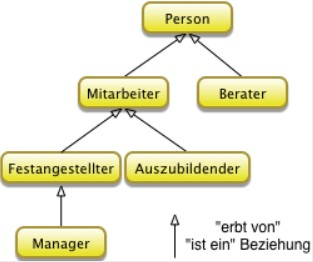
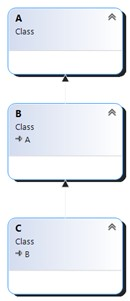
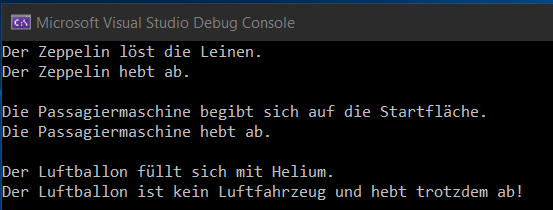
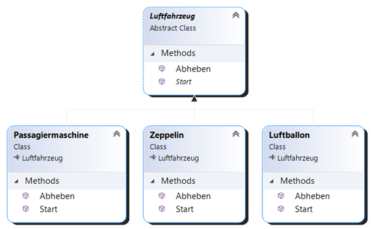
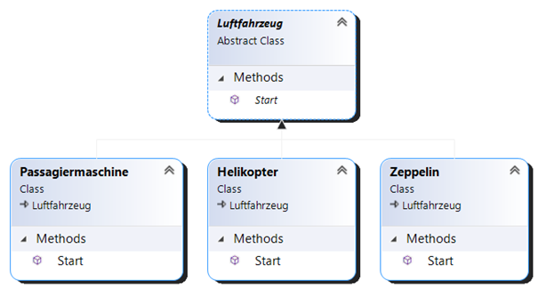
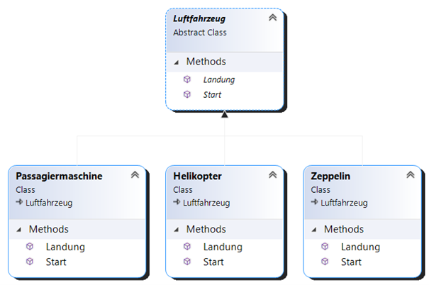

# Vererbung und Polymorphie

## Grundlagen der Vererbung
</br>

Die objektorientierte Programmierung stützt sich auf 3 Grundpfeiler: 

* Datenkapselung
* Vererbung
* Polymorphie

Die Vererbung (Inheritance) ist somit ein wichtiges Konzept in der objektorientierten Programmierung. Mit Hilfe von einer selbst definierten Klasse kann das Verhalten in weiteren Klassen wiederverwendet, geändert oder auch erweitert werden. Die Klasse, die ihr Verhalten weiterreicht, wird Basisklasse genannt und Klassen, die das Verhalten annehmen, werden abgeleitete Klassen genannt. Gängige Bezeichnungen für die Basisklasse sind unter anderem Ober-, Super- oder auch Elternklasse und die abgeleitete Klasse wird des Öfteren unter dem Namen Unter-, Sub- oder auch Kinderklasse erwähnt. Zwischen der Basis- und auch der Subklasse herrscht bei der Vererbung eine dauerhafte Beziehung. Mit Hilfe der Vererbung kann man den Programmieraufwand reduzieren und die Programmstruktur übersichtlicher gestalten. Neben der definierten Basisklasse erben auch alle anderen Klassen immer direkt oder indirekt von `object`.

</br>

## Ziele
</br>

In der Programmierung werden die Wiederverwendung und die Modellierung in Hierarchien angestrebt. Unter Wiederverwendung versteht man, dass man die Gemeinsamkeiten von Klassen herausfiltert (Generalisieren), diese in der Basisklasse implementiert und danach an weitere Subklassen weitervererbt. Es werden Daten und Methoden an die nächste Klasse weitergereicht (vererbt). Die Subklassen können nach Belieben erweitert werden und es kann auch eine ursprüngliche Methode der Basisklasse überschrieben werden. Die Modellierung in Hierarchien hat zur Folge, dass Abgrenzungen zwischen ähnlichen Objekten getroffen werden und dadurch wird auch das Verständnis für Vererbung und Polymorphie vereinfacht.

Bsp. einer Vererbungshierarchie:




</br>

## Mehrfachvererbung
</br>

Prinzipiell wird in der Programmierung zwischen Ein- und Mehrfachvererbung unterschieden. Bei der Einfachvererbung erbt eine Klasse von einer Basisklasse und bei der Mehrfachvererbung kann von mehreren Basisklassen geerbt werden. C# unterstützt keine Mehrfachvererbung, jedoch wird bei C# transitiv vererbt. Dies bedeutet, dass die Klasse C direkten Zugriff auf die Member von A hat, wenn B von A und C von B erbt.

Bsp. transitive Vererbung:



</br>

## Probleme bei der Vererbung
</br>

Speziell die Mehrfachvererbung kann zur Folge haben, das unerwartete Nebeneffekte auftreten da die Mehrfachvererbung sehr komplex und unüberschaubar werden kann. Um diese Nebeneffekte zu unterbinden, wird die Mehrfachvererbung in C# nicht unterstützt. Jedoch wird in C# transitiv vererbt und man kann sich mit Interfaces behelfen.

</br>

## Polymorphie
</br>

Polymorphie (Vielgestaltigkeit) ist auch ein Konzept der objektorientierten Programmierung wobei die Schlüsselwörter `virtual` und `abstract` die Basis dafür bilden. Unter Polymorphie versteht man, dass unterschiedliche Methoden gleichen Namens existieren.

Beispiel zu Polymorphie:

```csharp
public abstract class Luftfahrzeug
{
    public abstract void Start();
        
    public virtual string Abheben()
    {
        return "abheben";
    }
}

class Passagiermaschine : Luftfahrzeug
{
    string passagiermaschine = "Die Passagiermaschine";

    public override void Start()
    {
        Console.WriteLine("Die Passagiermaschine begibt sich auf die Startfläche.");
    }

    public override string Abheben()
    {

        return $"{passagiermaschine} {base.Abheben()}";
    }
}

public class Zeppelin : Luftfahrzeug
{
    string zeppelin = "Der Zeppelin";

    public override void Start()
    {
        Console.WriteLine("Der Zeppelin löst die Leinen.");
    }

    public override string Abheben()
    {
        return $"{zeppelin} {base.Abheben()}";
    }
}

public class Luftballon : Luftfahrzeug
{
    string ballon = "Der Luftballon ist kein Luftfahrzeug und hebt trotzdem ab!";

    public override void Start()
    {
        Console.WriteLine("Der Luftballon füllt sich mit Helium.");
    }

    public override string Abheben()
    {
        return ballon;
    }
}

static void Main(string[] args)
{
    var luftfahrzeug = new Luftfahrzeug();
    var zeppelin = new Zeppelin();
    var flugzeug = new Passagiermaschine();
    var ballon = new Luftballon();

    zeppelin.Start();
    Console.WriteLine(zeppelin.Abheben());

    flugzeug.Start();
    Console.WriteLine(flugzeug.Abheben());

    ballon.Start();
    Console.WriteLine(ballon.Abheben());
}

#Error -> Luftfahrzeug
CS0144	Cannot create an instance of the abstract type or interface 'Luftfahrzeug'
```





</br>

### Statisches & dynamisches Binden:
</br>

Statisches Binden (static binding) bedeutet, dass bereits der Compiler eine auszuführende Methode festlegt. Bei der dynamischen Bindung hingegen steht die Methode erst zur Programmausführung fest, da nur eine Schnittstelle zu Instanzen der unterschiedlichen Klassen besteht. Beim Polymorphismus ist man auf die dynamische Bindung angewiesen.

</br>

### Überladen vs. Überschreiben von Methoden:
</br>

Das Überladen ist das bewusste implementieren von Polymorphien. Methoden können zum Beispiel mit einem, zwei und auch mehreren Parametern erstellte werden. Auch der Datentyp kann erweitert werden. 

```csharp
    public int Plus(int number1, int number2)
    {
        return number1 + number2;
    }

    public int Plus(int number1, int number2, int number3)
    {
        return number1 + number2 + number3;
    }
```

Beim Überschreiben bleiben Datentyp und Anzahl der Parameter der unterschiedlichen Methoden gleich. Erst zur Laufzeit wird ausgehend vom dynamischen Typ entschieden, welche Methode aufgerufen wird.



</br>

## Schlüsselwörter
</br>

`base` : 

Wenn beim Konstruktor das Schlüsselwort `base` verwendet wird, wird der übergeordnete Konstruktor aufgerufen.

```csharp

public Worker (string name, string department)
    : base(name, department)
{
}

```
</br>

`sealed` :

Mit `sealed` wird in der Basisklasse eine Methode daran gehindert, dass sie weiter vererbt wird.

</br>

Deltaprogrammierung `virtual` / `override` :

Methoden in der Basisklasse die mit `virtual` versehen sind, kann man in der abgeleiteten Klasse verwenden und mit `override` überschreiben. Das Verhalten wird hier mitverwendet und / oder angepasst:


```csharp

public class A                        
{
    string auto = "Ein Auto ";

    public virtual string Method()
    {
        return auto;
    }
}

#Output
Ein Auto


public class B : A
{

    string motorrad = "und ein Motorrad";
    string fahrrad = "Es ist ein Fahrrad.";

    public override void Method1()
    {
        // 1. Die Basismethode wird hier ergänzt
        return $"{base.Method()} {motorrad}";
    }

    // oder

    public override void Method2()
    {
        // 2. Die Basismethode wird zu 100 % überschrieben
        return fahrrad;
    }
}

#Output Method1
Ein Auto und ein Motorrad.

#Output Method2
Es ist ein Fahrrad.
```
</br>

`abstract` / `override` :

Ist eine Basisklasse mit `abstract` versehen, kann keine Instanz davon erstellt werden und Methoden mit `abstract` müssen in der Subklasse implementiert und mit dem Schlüsselwort `override` überschrieben werden.

```csharp

public abstract class A
{
    public abstract string Method();
}

public class B : A
{
    public override string Method()
    {
        return "Hello World";
    }
}

#Output
Hello World

```


Wenn mehrere Klassen die selben Merkmale aufweisen, kann man diese Merkmale herausheben und in einer Basisklasse zusammenführen. Als Superklasse entsteht ein Überbegriff den es in der realen Welt nicht gibt aber von dem reale Dinge / Objekte abgeleitet werden (Generalisierung).

Beispiel für eine abstrakte Klasse:



In diesem Beispiel sieht man auch den klaren Vorteil der abstrakten Klasse. Es wird Codeverdoppelung vermieden in dem man die Basisklasse mit den benötigten Eigenschaften zur Verfügung stellt. Darüber hinaus kann auch in den Fällen Start und Landung jeweils eine spezielle Methode in den Subklassen implementiert werden, da jedes Luftfahrzeug ihr eigenes Start- und Landeverhalten hat. Auch konkrete Methoden können hier weitervererbt werden.
</br>

[Zur Übersicht](../README.md)