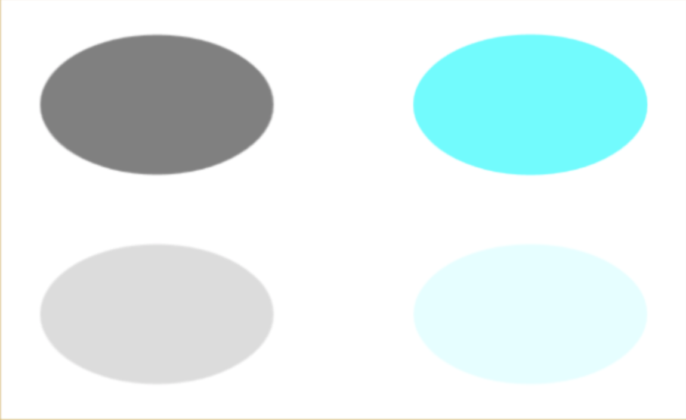
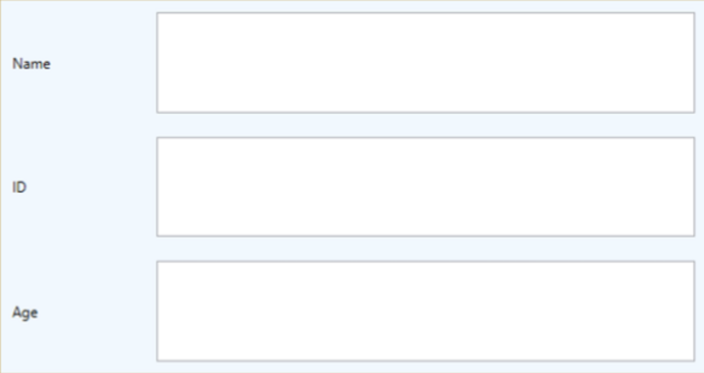

# WPF-Layouts und Controls

## Kurzwiederholung: Wozu WPF?
Mit Windows Presentation Foundation (WPF) können Entwickler auf einfache Weise UI-basierte Anwendungen erstellen.
<br>
WPF liefert dazu viele gängige UI-Elemente, die in fast jeder Windows-Anwendung verwendet werden.

<br><br>
<hr>
<br><br>

## Layouts

Das Layout ist sehr wichtig und entscheidend für die Benutzerfreundlichkeit der Anwendung. Es wird verwendet, um eine Gruppe von GUI-Elementen in der Applikation anzuordnen.
<br><br>
Das XAML-Layoutsystem bietet dabei eine automatische Größenanpassung von Elementen, Layoutfeldern und visuellen Zuständen, um eine reaktionsschnelle Benutzeroberfläche zu erstellen. 
<br><br>
Damit kann man auch ohne viel Erfahrung und mit einem ansprechenden Layout das User Interface auf Bildschirmen mit unterschiedlichen Fenstergrößen, Auflösungen, Pixeldichten und Ausrichtungen gut aussehen lassen.

<br><br>

### Stack Panel
Im Stack-Panel können untergeordnete Elemente je nach Ausrichtungseigenschaft vertikal oder horizontal in einer einzigen Linie angeordnet werden.


```xml
<StackPanel Orientation="Horizontal"> 
    <Button Content="Button" /> 
    <Button>Button</Button> 
</StackPanel> 
```

<br><br>

### WrapPanel
Im WrapPanel werden untergeordnete Elemente in der Reihenfolge von links nach rechts oder von oben nach unten positioniert. Das WrapPanel nutzt dabei die gegebene Länge und Höhe aus und bricht bei Bedarf die einzelnen Elemente in eine neue Reihe um.


```xml
<WrapPanel ItemWidth="100" ItemHeight="60">  
    <Button Content="Button 1" Margin="10"></Button>  
    <Button Content="Button 2" Margin="10"></Button>  
    <Button Content="Button 3" Margin="10"></Button>  
    <Button Content="Button 4" Margin="10"></Button>  
    <Button Content="Button 5" Margin="10"></Button>  
    <Button Content="Button 6" Margin="10"></Button>  
    <Button Content="Button 7" Margin="10"></Button>  
    <Button Content="Button 8" Margin="10"></Button>  
</WrapPanel>
```

<br><br>

### DockPanel
Das DockPanel definiert einen Bereich, in dem untergeordnete Elemente horizontal oder vertikal relativ zueinander angeordnet werden. Mit DockPanel können untergeordnete Elemente mithilfe der Dock-Eigenschaft ganz einfach nach oben, unten, rechts, links und in der Mitte angedockt werden.


```xml
<DockPanel>
    <Button DockPanel.Dock="Top" Height="50">Top</Button>
    <Button DockPanel.Dock="Bottom" Height="50">Bottom</Button>
    <Button DockPanel.Dock="Left" Width="50">Left</Button>
    <Button DockPanel.Dock="Right" Width="50">Right</Button>	
    <Button>Center</Button>
</DockPanel>
```

<br>

Ein wichtiges Property beim DockPanel ist außerdem _LastChildFill_ vom Datentyp bool.
Dieses gibt an, ob sich das letzte untergeordnete Element in einem DockPanel ausdehnt, um den noch verbleibenden Platz zu füllen. 

<br><br>

### CanvasPanel
Das CanvasPanel ist das grundlegende Layout-Bedienfeld, in dem die untergeordneten Elemente explizit mithilfe von Koordinaten positioniert werden können, die sich relativ zum Canvas auf einer beliebigen Seite wie links, rechts, oben und unten befinden.
<br><br>
Dieses Layout sollte jedoch nur für "Zeichnungen" verwendet werden, da sich der Inhalt aufgrund der fix positionierten Elemente nicht an die Größe des Fensters anpassen kann. Sollte der Benutzer beispielsweise die Fenstergröße verkleinern, kann es sein, dass der Inhalt nicht vollständig angezeigt wird.



```xml
<Canvas> 
    <Ellipse Canvas.Left="30" Canvas.Top="30"  
    Fill="Gray" Width="200" Height="120" /> 
    <Ellipse Canvas.Right="30" Canvas.Top="30"  
    Fill="Aqua" Width="200" Height="120" /> 
    <Ellipse Canvas.Left="30" Canvas.Bottom="30"  
    Fill="Gainsboro" Width="200" Height="120" /> 
    <Ellipse Canvas.Right="30" Canvas.Bottom="30"  
    Fill="LightCyan" Width="200" Height="120" /> 
</Canvas>
```

<br><br>

### GridPanel
Ein Grid-Panel (Rasterfeld) bietet einen flexiblen Bereich, der aus Zeilen und Spalten besteht. In einem Raster können untergeordnete Elemente in Tabellenform angeordnet werden.



```xml
<Grid Background="AliceBlue"> 
    <Grid.ColumnDefinitions> 
        <ColumnDefinition Width="Auto" /> 
        <ColumnDefinition />
    </Grid.ColumnDefinitions> 
    
    <Grid.RowDefinitions> 
        <RowDefinition Height="*" /> 
        <RowDefinition Height="*" /> 
        <RowDefinition Height="*" /> 
    </Grid.RowDefinitions> 
    
    <TextBlock Grid.Row="0" Grid.Column="0" Text="Name" Margin="10"  
        HorizontalAlignment="Left" VerticalAlignment="Center" Width="100" /> 
    <TextBox Grid.Row="0" Grid.Column="1" Margin="10" /> 
    <TextBlock Grid.Row="1" Grid.Column="0" Text="ID" Margin="10"  
        HorizontalAlignment="Left" VerticalAlignment="Center" Width="100" /> 
    <TextBox Grid.Row="1" Grid.Column="1" Margin="10" /> 
    <TextBlock Grid.Row="2" Grid.Column="0" Text="Age" Margin="10"  
        HorizontalAlignment="Left" VerticalAlignment="Center" Width="100" /> 
    <TextBox Grid.Row="2" Grid.Column="1" Margin="10" /> 
</Grid> 
```
<br>
Der Wert auto gibt an, dass die Größe an den Inhalt angepasst wird.<br>Hat eine ColumnDefinition also beispielsweise das Attribut und den Wert Width="Auto", dann sind alle diese Spalten genauso groß wie das breiteste Element in dieser Spalten-Reihe.
<br><br>
Wird jedoch der Wert * angegeben, so nimmt sich diese Spalte, Reihe, etc. den noch verbleibenden Platz und dehnt sich aus.
<br><br>
Mit ColumnSpan und RowSpan können zusätzlich noch Layouts oder Elemente über mehrere definierte Spalten und Reihen gestreckt werden. 


<br><br>
<hr>
<br><br>

## Steuerelemente / Controls

Windows Presentation Foundation (WPF) wird mit vielen der gängigen UI-Komponenten geliefert, die in fast jeder Windows-Anwendung verwendet werden.
<br><br>

### Übersicht der wichtigsten Steuerelemente:
| Control | Beschreibung | |
|---------|--------------|-|
| Button | Ein Steuerelement, das auf Benutzerinteraktionen reagiert |  |
| Calender | Stellt ein Steuerelement dar, mit dem ein Benutzer ein Datum mithilfe einer visuellen Kalenderanzeige auswählen kann |  |
| Checkbox | Ein Steuerelement, das ein Benutzer auswählen kann |  |
| ComboBox | Eine Dropdown-Liste mit Elementen, aus denen ein Benutzer auswählen kann |  |
| ContextMenu | Ein Kontextmenü (auch Popup- oder Popup-Menü) ist ein Menü, welches bei bestimmten Benutzeraktionen angezeigt wird, normalerweise durch Klicken mit der rechten Maustaste auf ein bestimmtes Steuerelement oder Fenster. Kontextmenüs werden häufig verwendet, um Funktionen anzubieten, die innerhalb eines einzelnen Steuerelements relevant sind. |  |
| DataGrid | Stellt ein Steuerelement dar, das Daten in einem anpassbaren Raster anzeigt |  |
| DatePicker | Ein Steuerelement, mit dem ein Benutzer ein Datum auswählen kann |  |
| Dialogs | Eine Anwendung kann auch zusätzliche Fenster anzeigen, um dem Benutzer das Sammeln oder Anzeigen wichtiger Informationen zu erleichtern |  |
| GridView | Ein Steuerelement, das eine Sammlung von Elementen in Zeilen und Spalten anzeigt |  |
| Image | Ein Steuerelement, das ein Bild darstellt |
| Label | Zeigt Text in einem Formular an |  |
| ListBox | Ein Steuerelement, das eine Liste von Elementen anzeigt, aus denen der Benutzer auswählen kann |  |
| Menus | Stellt ein Windows-Menüsteuerelement dar, mit dem Elemente, die Befehlen und Ereignishandler zugeordnet sind und hierarchisch organisiert werden können |  |
| PasswordBox | Ein Steuerelement zur Eingabe von Passwörtern |  |
| Popup | Das Popup-Steuerelement bietet die Möglichkeit, Inhalte in einem separaten Fenster anzuzeigen, das über dem aktuellen Anwendungsfenster relativ zu einem bestimmten Element oder einer bestimmten Bildschirmkoordinate schwebt |  |
| ProgressBar | Ein Steuerelement, das den Fortschritt durch Anzeigen eines Balkens anzeigt |  |
| RadioButton | Ein Steuerelement, mit dem ein Benutzer eine einzelne Option aus einer Gruppe von Optionen auswählen kann |  |
| ScrollViewer | Ein Containersteuerelement, mit dem der Benutzer seinen Inhalt schwenken und zoomen kann |  |
| Slider | Ein Steuerelement, mit dem der Benutzer aus einem Wertebereich auswählen kann, indem er ein Thumb-Steuerelement entlang einer Spur bewegt |  |
| TextBlock | Ein Steuerelement, das Text anzeigt |
| TextBox | Ein Steuerelement, welches dem Anwender erlaubt, Text sowohl in einer Zeile (Dialog), als auch in mehreren Zeilen (wie in einem Editor) zu schreiben |  |
| ToogleButton | Eine Schaltfläche, die zwischen zwei Zuständen umgeschaltet werden kann |  |
| ToolTip | Ein Popup-Fenster, in dem Informationen zu einem Element angezeigt werden |  |
| Window | Das Stammfenster mit Minimierungs-/Maximierungsoption, Schaltfläche zum Schließen des Fensters, Titelleiste und Rahmen |
<br>

Zusätzlich zu den von Microsoft zur Verfügung gestellten Controls können auch Steuerelemente von Drittanbietern verwendet werden.
<br><br>

Viele Steuerelemente verfügen über Properties, mit denen man die Darstellung des Steuerelements ändern kann.

<br>

Beispiele:
- Width
- Height
- Margin (Außenabstand)
- Padding (Innenabstand)
- Orientation
- Visibility
- Opacity
- BorderThickness
- BorderBrush (border background)
- Background
- FontSize
- FontFamily
- FontWeight
- Foreground

<br><br>
<hr>
<br>

## Best Practices
<br>

- Am Besten immer die von Microsoft mitgelieferten Layouts und Controls verwenden, wenn diese den Zweck erfüllen (Accessibility, Konsistenz).

<br>

- Das Styling einzelner Elemente nicht direkt bei den Elementen angeben, sondern im Window.Ressources Tag, wenn mehrere gleiche Elemente den Style annehmen sollen.
```xml
<Window.Resources>
    <Style TargetType="TextBlock">
        <Setter Property="Foreground" Value="Gray" />
        <Setter Property="FontSize" Value="24" />
    </Style>

    <Style x:Key="TextBlockBlue" TargetType="TextBlock">
        <Setter Property="Foreground" Value="Blue" />
        <Setter Property="FontSize" Value="24" />
    </Style>
</Window.Resources>

<StackPanel>
    <TextBlock>Header 1</TextBlock>
    <TextBlock>Header 2</TextBlock>
    <TextBlock Foreground="Blue">Header 3</TextBlock>
    <TextBlock Style="{StaticResource TextBlockBlue}">Header 4</TextBlock>
</StackPanel>
```
<br>

- Wenn man möchte, dass Styles in der gesamten Anwendung und in verschiedenen Fenstern verwendet werden können, kann man diese für die gesamte Anwendung definieren. Dies erfolgt in der App.xaml-Datei.

```xml
<Application x:Class="WpfLayoutsAndControls.App"
             xmlns="http://schemas.microsoft.com/winfx/2006/xaml/presentation"
             xmlns:x="http://schemas.microsoft.com/winfx/2006/xaml"
	 StartupUri="Styles/WindowWideStyleSample.xaml">
    <Application.Resources>
        <Style TargetType="TextBlock">
            <Setter Property="Foreground" Value="Gray" />
            <Setter Property="FontSize" Value="24" />
        </Style>
    </Application.Resources>
</Application>
```
<br>

- Fixe Positionen vermeiden.<br>Besser sind Alignment-Properties in Kombination mit Margins.

<br>

- Fixe Größen vermeiden.<br>Breite und Höhe wenn möglich immer auf Auto setzen.

<br><br>
<hr>

[Zur Übersicht](../README.md)
